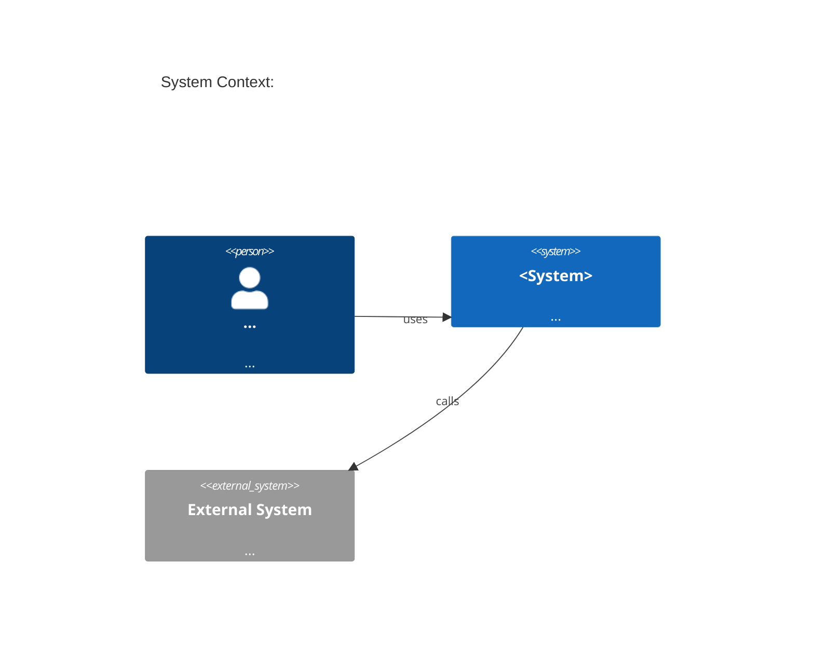

# SDD Generator

Follow this procedure to produce a complete, IEEE 1016 / arc42-compliant
Software Design Description. Never skip a step.

---

## Step 1 — Gather Inputs (ask_followup_question)

Before writing anything, establish:

1. **SRS reference** — Is there an existing SRS file to read? If yes, use
   `read_file` to load it. Extract REQ-IDs, scope, constraints.
2. **Backlog reference** — Is there a BACKLOG file in
   `delivery-documentation/`? If yes, read it. Scope the SDD to the
   stories scheduled in the current sprint first; document deferred design
   under a "Future Sprints" section rather than leaving it out entirely.
3. **Technology stack** — Languages, frameworks, databases, message brokers,
   cloud platform already in use.
4. **GraphQL schema** — Is there an existing schema file? If yes, read it.
5. **Data model** — Existing tables/entities? Liquibase changelog path?
6. **RabbitMQ topology** — Existing exchanges, queues, routing keys?
7. **Secret management** — Is Vault in use? Which secret paths?
8. **Observability stack** — Metrics (Prometheus?), tracing (OpenTelemetry?),
   logging (ELK/Loki?)?
9. **Deployment target** — Kubernetes, Docker Compose, bare metal?
10. **Known constraints and risks** — Anything that restricts the design?

Read every referenced file before writing. Do not assume its contents.

---

## Step 2 — Plan output files

Default output layout:
```
technical-documentation/
  SDD-<feature-name>.md          (main design document)
  adrs/
    ADR-001-<title>.md
    ADR-002-<title>.md
  migrations/
    <timestamp>-<feature>.xml    (Liquibase changeset stub)
```

Confirm paths with the user.

---

## Step 3 — Write the SDD

Use `write_file`. Structure it exactly as follows (arc42 sections, IEEE 1016 headers).

### Document Structure

```
# SDD: <Feature Name>
**Document ID:** SDD-<YYYYMMDD>-001
**Version:** 1.0
**Status:** Draft
**Standards:** IEEE 1016:2009, arc42
**SRS Reference:** SRS-<ID>

---

## 1. Introduction and Goals
### 1.1 Requirements Overview (link to REQ-IDs)
### 1.2 Quality Goals (top 3-5 from NFRs, with priority)
### 1.3 Stakeholders (design-relevant roles only)

## 2. Constraints
### 2.1 Technical Constraints
### 2.2 Organisational Constraints
### 2.3 Conventions

## 3. Solution Strategy
Narrative: the key decisions that shape the architecture. Each decision
references an ADR (ADR-NNN).

## 4. C4 Context Diagram


## 5. C4 Container Diagram
```mermaid
C4Container
  title Container Diagram: <Feature Name>
  ...
```

## 6. C4 Component Diagram
```mermaid
C4Component
  title Component Diagram: <Service Name>
  ...
```

## 7. High-Level Design (HLD)
### 7.1 Architectural Style
### 7.2 Key Flows (sequence diagrams using Mermaid sequenceDiagram)
### 7.3 Deployment View

## 8. Low-Level Design (LLD)
### 8.1 Module / Class Responsibilities
### 8.2 Key Algorithms and Business Logic
### 8.3 Error Handling Strategy

## 9. API Contracts
### 9.1 GraphQL Schema Changes
Document as a diff block showing added/modified types, queries, mutations,
subscriptions. Show the before and after for each change.

### 9.2 REST Endpoints (if any)
| Method | Path | Request | Response | Auth |
|---|---|---|---|---|

## 10. Data Model
### 10.1 Entity-Relationship Diagram (Mermaid erDiagram)
### 10.2 Table Definitions
For each new/changed table:
| Column | Type | Nullable | Default | Index | Description |

### 10.3 Liquibase Migration Plan
Reference the changeset files in technical-documentation/migrations/.
Describe rollback strategy for each change.

## 11. Integration and Event Design (RabbitMQ)
### 11.1 Event Catalogue
| Event Name | Exchange | Routing Key | Producer | Consumer | Payload Schema |
|---|---|---|---|---|---|

### 11.2 Exchange and Queue Topology
### 11.3 Message Schema (JSON Schema or example payload per event)
### 11.4 Error and Dead-Letter Strategy

## 12. Cross-Cutting Concepts
### 12.1 Security
- Authentication/authorisation approach
- Vault secret paths and rotation policy
- Input validation and output encoding

### 12.2 Caching
- What is cached, where (in-process/Redis/CDN), TTL, invalidation strategy

### 12.3 Observability
- Metrics: key gauges/counters/histograms and their labels
- Distributed tracing: span naming conventions
- Structured logging: log levels and mandatory fields

### 12.4 Resilience
- Retry policy, circuit breaker settings, bulkheads, timeouts

## 13. Architecture Decision Records
List ADR filenames and one-line summaries. Full ADRs in technical-documentation/adrs/.

| ADR | Title | Status | Decision |
|---|---|---|---|
| ADR-001 | ... | Accepted | ... |

## 14. Risk and Technical Debt Assessment
| ID | Risk/Debt | Likelihood | Impact | Mitigation |
|---|---|---|---|---|
| RISK-001 | ... | High/Med/Low | High/Med/Low | ... |

## 15. Feasibility and Impact Analysis
### 15.1 Technical Feasibility
### 15.2 Impact on Existing Systems
### 15.3 Estimated Complexity (S/M/L/XL per component)

## 16. Revision History
| Version | Date | Author | Changes |
|---|---|---|---|
| 1.0 | <date> | Technical Architect Agent | Initial draft |
```

---

## Step 4 — Write ADRs

For each significant architectural decision, create a separate ADR file in
`technical-documentation/adrs/ADR-NNN-<kebab-title>.md` using Nygard format:

```
# ADR-NNN: <Title>

**Date:** <YYYY-MM-DD>
**Status:** Proposed | Accepted | Deprecated | Superseded by ADR-NNN

## Context
<What situation or problem forced this decision?>

## Decision
<What was decided, stated as a single active-voice sentence.>

## Consequences
### Positive
- ...

### Negative
- ...

### Neutral
- ...
```

Write at least one ADR per major technology or pattern choice.

---

## Step 5 — Write Liquibase changeset stubs

For each DDL change (CREATE TABLE, ALTER TABLE, ADD COLUMN, etc.), create a
Liquibase XML changeset stub in `technical-documentation/migrations/`:

```xml
<?xml version="1.0" encoding="UTF-8"?>
<databaseChangeLog xmlns="http://www.liquibase.org/xml/ns/dbchangelog"
    xmlns:xsi="http://www.w3.org/2001/XMLSchema-instance"
    xsi:schemaLocation="http://www.liquibase.org/xml/ns/dbchangelog
        http://www.liquibase.org/xml/ns/dbchangelog/dbchangelog-4.20.xsd">

    <changeSet id="<YYYYMMDDHHMMSS>-001" author="technical-architect-agent">
        <!-- TODO: implement -->
        <rollback>
            <!-- TODO: rollback SQL -->
        </rollback>
    </changeSet>
</databaseChangeLog>
```

---

## Step 6 — Validate completeness

- [ ] Every REQ-F from the SRS is addressed by at least one design element
- [ ] Every API change has a before/after schema diff
- [ ] Every new table has a Liquibase changeset stub
- [ ] Every RabbitMQ event has a payload schema example
- [ ] Every ADR has a Status and Consequences section
- [ ] No section is empty without a RISK or open question entry

---

## Step 7 — Report to user

State:
- All files created and their paths
- Count of: ADRs written, migrations stubbed, events catalogued, risks logged
- Any open design questions that need resolution before implementation
