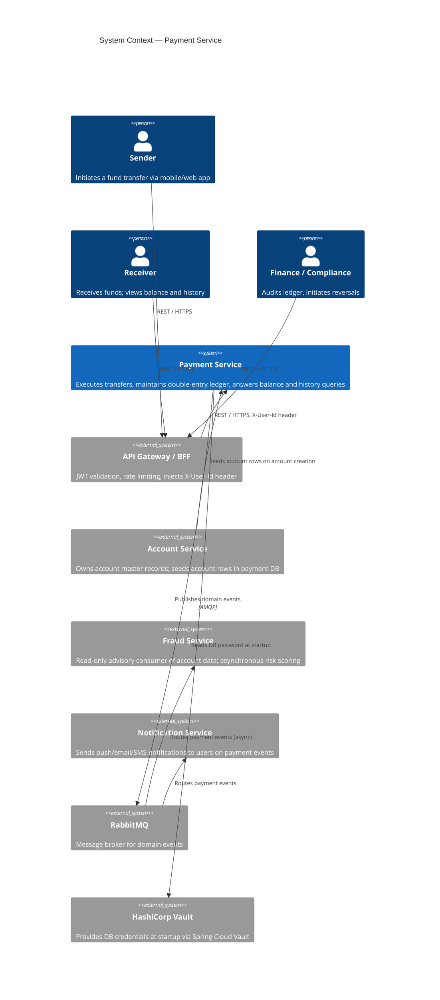
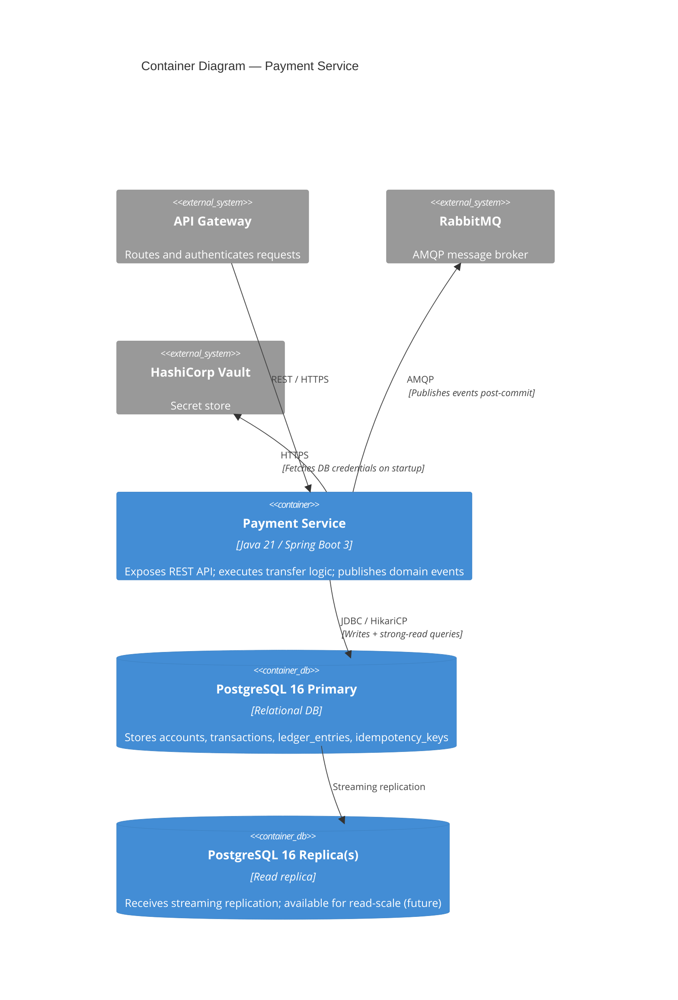
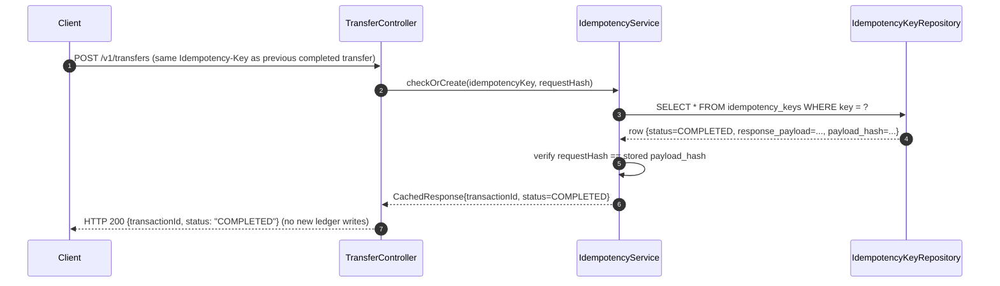
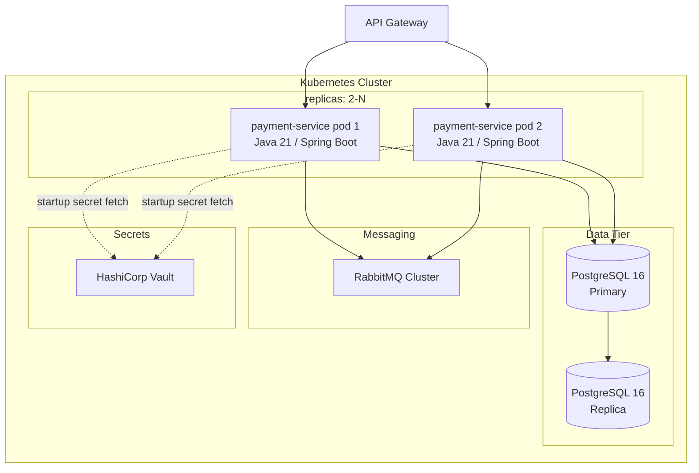
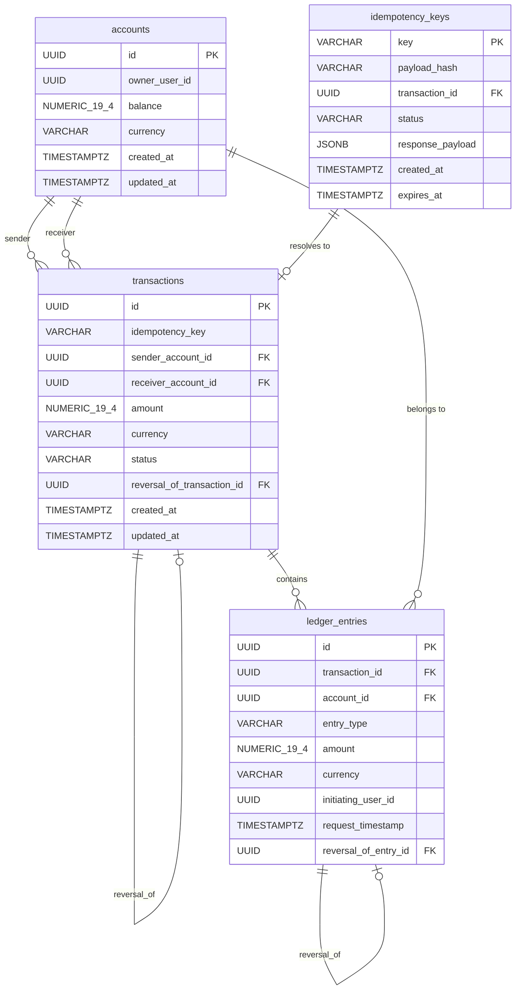
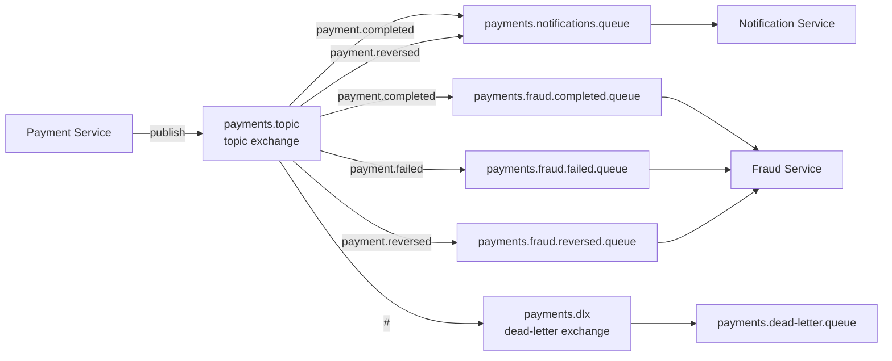

# SDD: Payment Service

**Document ID:** SDD-20250115-001  
**Version:** 1.0  
**Status:** Draft  
**Standards:** IEEE 1016:2009, arc42  
**SRS Reference:** SRS-20250115-001  
**Backlog Reference:** BACKLOG-payment-service v1.0  

---

## 1. Introduction and Goals

### 1.1 Requirements Overview

The Payment Service is the authoritative record-keeper for every money movement in a Venmo-like peer-to-peer wallet platform. It owns the double-entry ledger, account balances, idempotent transfer execution, transfer reversal, and all read queries against that ledger.

Covered REQ-IDs (functional, sprint-scoped):

| REQ-ID | Summary |
|---|---|
| REQ-F-001 | Atomic debit/credit in a single DB transaction |
| REQ-F-002 | Reject transfer if sender balance is insufficient |
| REQ-F-003 | Reject zero or negative transfer amounts |
| REQ-F-004 | Reject self-transfers (sender == receiver) |
| REQ-F-005 | Monetary precision — `NUMERIC(19,4)` / `BigDecimal` |
| REQ-F-006 | Return unique system-generated transaction ID |
| REQ-F-007 | Accept client-supplied `Idempotency-Key` UUID header |
| REQ-F-008 | Duplicate key on completed transfer → return cached response |
| REQ-F-009 | In-progress transfer with same key → HTTP 409 |
| REQ-F-010 | Key reused with different payload → HTTP 422 |
| REQ-F-011 | Idempotency records persisted ≥ 24 hours |
| REQ-F-012 | Pessimistic row locks in ascending wallet-ID order |
| REQ-F-013 | DB-level CHECK constraint: balance ≥ 0 |
| REQ-F-014 | Deadlock retry ≤ 3 attempts with exponential backoff |
| REQ-F-015 | Immutable ledger entries with full audit fields |
| REQ-F-016 | No UPDATE/DELETE on committed ledger entries |
| REQ-F-017 | Net-zero invariant per transaction |
| REQ-F-018 | Current balance query |
| REQ-F-019 | Point-in-time balance query |
| REQ-F-020 | Paginated transaction history (default descending) |
| REQ-F-021 | Date-range filter on history |
| REQ-F-022 | Entry-type filter on history |
| REQ-F-023 | Transfer status by transaction ID |
| REQ-F-024 | Status enum: PENDING, COMPLETED, FAILED, REVERSED |
| REQ-F-025 | Reversal creates offsetting journal entries atomically |
| REQ-F-026 | Reject reversal if already REVERSED or FAILED |
| REQ-F-027 | Reversal links to original transaction ID in ledger |

### 1.2 Quality Goals

| Priority | Quality Characteristic | Target |
|---|---|---|
| 1 | **Functional Correctness** — net ledger balance delta = 0 | 0 discrepancy in every daily reconciliation run (REQ-NF-008) |
| 2 | **Security / Non-repudiation** — every mutation fully traceable | 100% of ledger entries carry `userId`, `requestTimestamp`, `transactionId` (REQ-NF-010) |
| 3 | **Reliability** — exactly-once execution under retries | 0 duplicate ledger entries in production (BO-002) |
| 4 | **Performance Efficiency** — low-latency critical paths | POST /v1/transfers p95 ≤ 500 ms; GET balance p95 ≤ 100 ms (REQ-NF-001/002) |
| 5 | **Maintainability** — observable and testable | ≥ 90% line coverage on transfer/ledger packages; 100% traced requests (REQ-NF-013/012) |

### 1.3 Stakeholders (design-relevant)

| Stakeholder | Design Concern |
|---|---|
| Finance / Compliance | Immutable ledger, net-zero invariant, reversal with original-entry linkage |
| Platform Engineering | Observability, health probes, horizontal scalability, zero-downtime deploy |
| Product Engineering | Clear API contracts, versioned endpoints, testable acceptance criteria |
| End Users (via API Gateway) | Correct balances, idempotent retries, low-latency reads |

---

## 2. Constraints

### 2.1 Technical Constraints

| ID | Constraint |
|---|---|
| CON-001 | Java 21, Spring Boot 3.x |
| CON-002 | PostgreSQL 16; `SELECT FOR UPDATE` for concurrency |
| CON-003 | Monetary amounts as `NUMERIC(19,4)` in DB, `BigDecimal` (scale 4, `RoundingMode.HALF_EVEN`) in Java — no `double`/`float` anywhere |
| CON-004 | Stateless application tier; all durable state in PostgreSQL |
| CON-005 | JSON envelope format for all REST responses |
| CON-006 | All DDL via Liquibase — no ad-hoc DDL in production |
| CON-007 | Structured JSON logs to stdout (logstash-logback-encoder) |
| CON-008 | `/health/liveness` and `/health/readiness` for Kubernetes probes |
| CON-009 | No external payment rail integrations in scope |

### 2.2 Organisational Constraints

- Authentication is handled by the API Gateway; this service trusts the `X-User-Id` header.
- Account master records are owned by the Account Service; payment DB stores them as FK-only references.
- Fraud Service is a read-only advisory consumer — it does not block transfers synchronously.

### 2.3 Conventions

- URI versioning: all endpoints prefixed `/v1/`.
- UUIDs (version 4) as primary keys for all entities.
- All timestamps: ISO-8601 UTC (`Instant` in Java, `TIMESTAMPTZ` in PostgreSQL).
- BigDecimal rounding: `RoundingMode.HALF_EVEN`, scale always 4.
- Error responses follow a standard envelope: `{ "errorCode": "...", "message": "...", "traceId": "..." }`.

---

## 3. Solution Strategy

Five decisions shape the architecture of this service. Each is captured in a full ADR:

| Decision | Rationale | ADR |
|---|---|---|
| **Double-entry bookkeeping** — every transfer writes exactly two ledger entries (debit + credit) inside one ACID transaction | The only design that guarantees net-zero and provides an immutable audit trail without a separate reconciliation job | ADR-001 |
| **Pessimistic row-level locking** (`SELECT FOR UPDATE`) with ascending wallet-ID lock ordering | Guarantees serialised balance mutations; eliminates lost updates; deterministic lock order prevents deadlocks | ADR-002 |
| **Idempotency-key table in PostgreSQL** — unique constraint as the atomic insertion gate, checked before any ledger write | Exactly-once semantics without a distributed cache; survives pod restarts; consistent with ASM-004 | ADR-003 |
| **Spring Boot 3 + Spring Data JPA** on Java 21 | Platform engineering mandate; Virtual Threads (Project Loom) available for I/O concurrency at high TPS | (platform mandate, no ADR) |
| **RabbitMQ outbound events** — `payment.completed`, `payment.failed`, `payment.reversed` | Decouples Notification Service and Fraud Service from the payment critical path; event published after DB commit using a transactional outbox pattern | (see §11) |

---

## 4. C4 Context Diagram



---

## 5. C4 Container Diagram



---

## 6. C4 Component Diagram

```mermaid
C4Component
  title Component Diagram — Payment Service

  Container_Ext(gateway, "API Gateway")
  Container_Ext(pg, "PostgreSQL 16")
  Container_Ext(rabbit, "RabbitMQ")

  Component(transferCtrl, "TransferController", "Spring @RestController", "POST /v1/transfers, POST /v1/transfers/{id}/reverse")
  Component(balanceCtrl, "BalanceController", "Spring @RestController", "GET /v1/accounts/{id}/balance")
  Component(txnCtrl, "TransactionController", "Spring @RestController", "GET /v1/transfers/{id}")
  Component(historyCtrl, "TransactionHistoryController", "Spring @RestController", "GET /v1/accounts/{id}/transactions")

  Component(idempotencySvc, "IdempotencyService", "Spring @Service", "Checks/creates idempotency key records; detects duplicates and in-progress transfers")
  Component(transferSvc, "TransferService", "Spring @Service", "Orchestrates lock acquisition, balance mutation, ledger writes, event publishing")
  Component(ledgerSvc, "LedgerService", "Spring @Service", "Writes double-entry journal entries; asserts net-zero")
  Component(reversalSvc, "ReversalService", "Spring @Service", "Validates reversibility, orchestrates offsetting entries")
  Component(accountSvc, "AccountService", "Spring @Service", "Balance inquiry, point-in-time queries")
  Component(txnHistSvc, "TransactionHistoryService", "Spring @Service", "Paginated, filtered ledger queries")
  Component(eventPublisher, "DomainEventPublisher", "Spring @Component", "Publishes payment events to RabbitMQ after DB commit")

  Component(accountRepo, "AccountRepository", "Spring Data JPA", "findByIdForUpdate() with PESSIMISTIC_WRITE lock")
  Component(ledgerRepo, "LedgerEntryRepository", "Spring Data JPA", "Insert-only; JPA @Immutable entity")
  Component(txnRepo, "TransactionRepository", "Spring Data JPA", "CRUD for transactions table")
  Component(idempotencyRepo, "IdempotencyKeyRepository", "Spring Data JPA", "Unique-constrained insert; TTL cleanup")
  Component(exHandler, "GlobalExceptionHandler", "Spring @ControllerAdvice", "Maps domain exceptions to HTTP status codes")

  Rel(gateway, transferCtrl, "REST")
  Rel(gateway, balanceCtrl, "REST")
  Rel(gateway, txnCtrl, "REST")
  Rel(gateway, historyCtrl, "REST")

  Rel(transferCtrl, idempotencySvc, "checkOrCreate()")
  Rel(transferCtrl, transferSvc, "initiateTransfer()")
  Rel(reversalSvc, ledgerSvc, "recordReversal()")
  Rel(transferCtrl, reversalSvc, "reverse()")
  Rel(transferSvc, accountRepo, "findByIdForUpdate()")
  Rel(transferSvc, ledgerSvc, "recordTransfer()")
  Rel(transferSvc, eventPublisher, "publishEvent()")
  Rel(ledgerSvc, ledgerRepo, "save()")
  Rel(ledgerSvc, txnRepo, "save()")
  Rel(idempotencySvc, idempotencyRepo, "findByKey() / save()")
  Rel(accountSvc, accountRepo, "findById()")
  Rel(txnHistSvc, ledgerRepo, "findAll(spec, pageable)")
  Rel(eventPublisher, rabbit, "AMQP publish")
  Rel(accountRepo, pg, "SQL")
  Rel(ledgerRepo, pg, "SQL")
  Rel(txnRepo, pg, "SQL")
  Rel(idempotencyRepo, pg, "SQL")
```



---

## 7. High-Level Design (HLD)

### 7.1 Architectural Style

The Payment Service is a **single-process, stateless microservice** following a layered architecture:

```
Controller (REST) → Service (business logic) → Repository (JPA) → PostgreSQL
                                              ↘ DomainEventPublisher → RabbitMQ
```

Key patterns in use:
- **Unit of Work / @Transactional** — every write path is wrapped in a single Spring-managed transaction; JPA flushes all changes atomically.
- **Repository Pattern** — all DB access via Spring Data JPA repositories; no SQL scattered in service classes.
- **Idempotency Filter** — a cross-cutting service layer wraps the transfer entry point; checks the key before the transaction opens.
- **Transactional Outbox (lightweight)** — events are published via `TransactionSynchronizationManager.registerSynchronization()` in an `afterCommit` hook, guaranteeing the event is only sent after the DB transaction succeeds.

### 7.2 Key Flows

#### 7.2.1 Happy-Path Transfer (POST /v1/transfers)

```mermaid
sequenceDiagram
  autonumber
  participant C as Client
  participant TC as TransferController
  participant IS as IdempotencyService
  participant TS as TransferService
  participant AR as AccountRepository
  participant LS as LedgerService
  participant LR as LedgerEntryRepository
  participant TR as TransactionRepository
  participant IR as IdempotencyKeyRepository
  participant EP as DomainEventPublisher
  participant PG as PostgreSQL
  participant MQ as RabbitMQ

  C->>TC: POST /v1/transfers {senderAccountId, receiverAccountId, amount, Idempotency-Key}
  TC->>IS: checkOrCreate(idempotencyKey, requestHash)
  IS->>IR: INSERT idempotency_keys (status=PENDING) — unique constraint gate
  IR-->>IS: OK (new key)
  IS-->>TC: proceed

  TC->>TS: initiateTransfer(request, userId)
  Note over TS,PG: @Transactional BEGIN

  TS->>AR: findByIdForUpdate([min(senderId,receiverId), max(senderId,receiverId)])
  AR->>PG: SELECT * FROM accounts WHERE id IN (?,?) ORDER BY id FOR UPDATE
  PG-->>AR: locked account rows

  TS->>TS: validate: amount > 0, sender ≠ receiver, sender.balance ≥ amount
  TS->>TS: sender.balance -= amount; receiver.balance += amount
  TS->>AR: save(sender), save(receiver)

  TS->>LS: recordTransfer(transactionId, senderId, receiverId, amount)
  LS->>TR: save(Transaction{status=PENDING})
  LS->>LR: save(LedgerEntry{DEBIT, senderId, amount})
  LS->>LR: save(LedgerEntry{CREDIT, receiverId, amount})
  LS->>LS: assert DEBIT.amount == CREDIT.amount (net-zero check)
  LS->>TR: update(Transaction{status=COMPLETED})

  Note over TS,PG: @Transactional COMMIT

  TS->>IS: markCompleted(idempotencyKey, transactionId, responsePayload)
  IS->>IR: UPDATE idempotency_keys SET status=COMPLETED, transaction_id=?, response_payload=?

  TS->>EP: publishAfterCommit(PaymentCompletedEvent)
  EP->>MQ: AMQP publish → payments.exchange / payment.completed

  TS-->>TC: TransferResult{transactionId, status=COMPLETED}
  TC-->>C: HTTP 201 {transactionId, status: "COMPLETED", ...}
```

#### 7.2.2 Idempotent Retry (Completed Key)



#### 7.2.3 Transfer Reversal (POST /v1/transfers/{id}/reverse)

```mermaid
sequenceDiagram
  autonumber
  participant C as Client (Finance)
  participant RC as ReversalController
  participant RS as ReversalService
  participant TR as TransactionRepository
  participant AR as AccountRepository
  participant LS as LedgerService
  participant EP as DomainEventPublisher
  participant PG as PostgreSQL
  participant MQ as RabbitMQ

  C->>RC: POST /v1/transfers/{transactionId}/reverse
  RC->>RS: reverse(transactionId, userId)

  RS->>TR: findById(transactionId)
  TR-->>RS: Transaction{status=COMPLETED, senderAccountId, receiverAccountId, amount}

  RS->>RS: guard: status must be COMPLETED (else 422)

  Note over RS,PG: @Transactional BEGIN

  RS->>AR: findByIdForUpdate([min(senderId,receiverId), max(senderId,receiverId)])
  AR->>PG: SELECT * FROM accounts WHERE id IN (?,?) ORDER BY id FOR UPDATE
  PG-->>AR: locked rows

  RS->>RS: guard: receiver.balance >= amount (else 422 INSUFFICIENT_FUNDS_FOR_REVERSAL)
  RS->>RS: receiver.balance -= amount; sender.balance += amount
  RS->>AR: save(sender), save(receiver)

  RS->>LS: recordReversal(originalTxnId, senderId, receiverId, amount)
  LS->>TR: save(Transaction{status=COMPLETED, reversalOf=originalTxnId}) [reversal txn]
  LS->>LR: save(LedgerEntry{CREDIT, senderId, amount, reversalOfEntryId=originalDebitId})
  LS->>LR: save(LedgerEntry{DEBIT, receiverId, amount, reversalOfEntryId=originalCreditId})
  LS->>TR: update(originalTransaction{status=REVERSED})

  Note over RS,PG: @Transactional COMMIT

  RS->>EP: publishAfterCommit(PaymentReversedEvent)
  EP->>MQ: AMQP publish → payments.exchange / payment.reversed

  RS-->>RC: ReversalResult{reversalTransactionId}
  RC-->>C: HTTP 201 {reversalTransactionId}
```

### 7.3 Deployment View



Deployment characteristics:
- **Horizontal scaling**: Stateless pods behind a load balancer; any pod handles any request.
- **Rolling deployments**: Kubernetes `RollingUpdate` strategy; Liquibase runs on startup with a `DATABASECHANGELOGLOCK` to prevent concurrent migrations.
- **Health probes**: `/health/liveness` (JVM alive), `/health/readiness` (DB reachable).

---

## 8. Low-Level Design (LLD)

### 8.1 Module / Class Responsibilities

#### Layer: API (Controllers + DTOs)

| Class | Responsibility |
|---|---|
| `TransferController` | Binds `POST /v1/transfers` and `POST /v1/transfers/{id}/reverse`; extracts `Idempotency-Key` and `X-User-Id` headers; delegates to `IdempotencyService` then `TransferService` / `ReversalService`. |
| `BalanceController` | Binds `GET /v1/accounts/{accountId}/balance?asOf=`; delegates to `AccountService`. |
| `TransactionController` | Binds `GET /v1/transfers/{transactionId}`; delegates to `TransactionService`. |
| `TransactionHistoryController` | Binds `GET /v1/accounts/{accountId}/transactions?page&pageSize&from&to&type`; delegates to `TransactionHistoryService`. |
| `GlobalExceptionHandler` | `@ControllerAdvice`; maps all domain exceptions to HTTP status + error envelope. See §8.3. |
| `TransferRequest` | `@NotNull senderAccountId`, `@NotNull receiverAccountId`, `@Positive amount` (BigDecimal), `@NotBlank currency`. |
| `TransferResponse` | `transactionId` (UUID), `status` (String), `amount` (BigDecimal), `currency`, `createdAt` (Instant). |
| `ReversalResponse` | `reversalTransactionId` (UUID), `originalTransactionId` (UUID), `status`, `createdAt`. |
| `BalanceResponse` | `accountId`, `balance` (BigDecimal), `currency`, `asOf` (Instant, nullable). |
| `TransactionStatusResponse` | `transactionId`, `status`, `amount`, `senderAccountId`, `receiverAccountId`, `createdAt`. |
| `PagedTransactionResponse` | `entries` (List), `totalCount`, `page`, `pageSize`, `totalPages`. |

#### Layer: Service (Business Logic)

| Class | Responsibility |
|---|---|
| `IdempotencyService` | `checkOrCreate(key, hash)` — attempts INSERT; on unique-constraint violation reads existing row; dispatches to `COMPLETED` (return cache), `PENDING` (throw `TransferInProgressException`), or hash-mismatch (throw `IdempotencyKeyConflictException`). `markCompleted(key, txnId, payload)` — updates row after successful transfer. Scheduled `@Scheduled` cleanup of expired keys. |
| `TransferService` | `@Retryable(CannotAcquireLockException, maxAttempts=3, backoff=50ms×2)` on `initiateTransfer()`. Sorts account IDs ascending, acquires pessimistic locks, validates business rules, mutates balances, calls `LedgerService.recordTransfer()`, publishes event. |
| `LedgerService` | `recordTransfer(txnId, debitAccountId, creditAccountId, amount, userId)` — within the caller's `@Transactional` context: persists Transaction row (PENDING→COMPLETED), persists two `LedgerEntry` rows, asserts `debitEntry.amount.compareTo(creditEntry.amount) == 0`. |
| `ReversalService` | `reverse(originalTxnId, userId)` — loads original transaction, guards state machine, acquires locks in sorted order, reverses balances, calls `LedgerService.recordReversal()`, updates original transaction status to REVERSED, publishes event. |
| `AccountService` | `getCurrentBalance(accountId)` — reads `account.balance`. `getBalanceAsOf(accountId, asOf)` — SUM CREDIT – SUM DEBIT from `ledger_entries` where `account_id=? AND request_timestamp<=?`. |
| `TransactionHistoryService` | `getHistory(accountId, filter, pageable)` — applies `LedgerEntrySpecification`; returns `Page<LedgerEntry>`. |
| `DomainEventPublisher` | `publishAfterCommit(event)` — registers a `TransactionSynchronizationAdapter.afterCommit()` callback to publish to RabbitMQ. Guarantees at-least-once delivery post-commit. |

#### Layer: Repository (Data Access)

| Repository | Key Methods |
|---|---|
| `AccountRepository` | `findByIdForUpdate(List<UUID> ids)` — native query `SELECT * FROM accounts WHERE id IN (:ids) ORDER BY id FOR UPDATE`; `@Lock(PESSIMISTIC_WRITE)`. |
| `LedgerEntryRepository` | `save(LedgerEntry)` — insert only; entity class annotated `@org.hibernate.annotations.Immutable`; `merge()` override throws `UnsupportedOperationException`. |
| `TransactionRepository` | Standard JPA `CrudRepository` + `findById`. |
| `IdempotencyKeyRepository` | `findByKey(String key)`, `save()`, `deleteByExpiresAtBefore(Instant now)`. |

#### Layer: Domain Entities

| Entity | Table | Notes |
|---|---|---|
| `Account` | `accounts` | `balance` field is `BigDecimal`; mapped to `NUMERIC(19,4)`. |
| `Transaction` | `transactions` | `status` is `@Enumerated(EnumType.STRING)` `TransactionStatus`. |
| `LedgerEntry` | `ledger_entries` | `@Immutable`; `entryType` is `@Enumerated(EnumType.STRING)` `EntryType`; `reversalOfEntryId` is nullable FK. |
| `IdempotencyKey` | `idempotency_keys` | `payloadHash` stores SHA-256 hex of `{senderAccountId|receiverAccountId|amount}`; `responsePayload` is JSONB. |

### 8.2 Key Algorithms and Business Logic

#### 8.2.1 Transfer Execution — Critical Path (Full LLD)

```
TransferService.initiateTransfer(TransferRequest req, UUID userId):

  1. SORT account IDs:
       List<UUID> orderedIds = Stream.of(req.senderAccountId, req.receiverAccountId)
           .sorted()
           .collect(toList());

  2. ACQUIRE LOCKS:
       List<Account> locked = accountRepository.findByIdForUpdate(orderedIds);
       Account sender   = findById(locked, req.senderAccountId);
       Account receiver = findById(locked, req.receiverAccountId);
       // Throws EntityNotFoundException if either account missing → HTTP 404

  3. VALIDATE:
       if (req.amount.compareTo(BigDecimal.ZERO) <= 0)
           throw InvalidAmountException(req.amount);
       if (req.senderAccountId.equals(req.receiverAccountId))
           throw SelfTransferException();
       if (sender.getBalance().compareTo(req.amount) < 0)
           throw InsufficientFundsException(sender.getBalance(), req.amount);

  4. MUTATE BALANCES (all BigDecimal, scale=4, RoundingMode.HALF_EVEN):
       BigDecimal scaled = req.amount.setScale(4, HALF_EVEN);
       sender.setBalance(sender.getBalance().subtract(scaled));
       receiver.setBalance(receiver.getBalance().add(scaled));
       accountRepository.save(sender);
       accountRepository.save(receiver);

  5. WRITE LEDGER (delegates to LedgerService within same @Transactional):
       UUID txnId = UUID.randomUUID();
       ledgerService.recordTransfer(txnId, sender.getId(), receiver.getId(), scaled, userId);
       // LedgerService:
       //   a. persist Transaction{id=txnId, status=PENDING, ...}
       //   b. persist LedgerEntry{DEBIT,  senderAccountId,   scaled, txnId, userId, now()}
       //   c. persist LedgerEntry{CREDIT, receiverAccountId, scaled, txnId, userId, now()}
       //   d. assert debitEntry.amount == creditEntry.amount  ← net-zero guard
       //   e. update Transaction{status=COMPLETED}

  6. @Transactional COMMIT (Spring + HikariCP flush)

  7. PUBLISH EVENT (afterCommit hook):
       eventPublisher.publishAfterCommit(
           new PaymentCompletedEvent(txnId, sender.getId(), receiver.getId(), scaled, now())
       );

  8. RETURN TransferResult{txnId, COMPLETED}
```

**Deadlock retry wrapper** (Spring Retry annotation on `initiateTransfer()`):

```java
@Retryable(
    retryFor  = CannotAcquireLockException.class,
    maxAttempts = 3,
    backoff   = @Backoff(delay = 50, multiplier = 2.0, random = true)
)
public TransferResult initiateTransfer(TransferRequest req, UUID userId) { ... }

@Recover
public TransferResult handleDeadlockExhaustion(CannotAcquireLockException ex,
        TransferRequest req, UUID userId) {
    throw new DeadlockExhaustedException("Transfer failed after 3 lock attempts", ex);
}
```

Backoff schedule: attempt 1 at 0 ms, retry 1 after ~50 ms, retry 2 after ~100 ms (plus jitter). `DeadlockExhaustedException` maps to HTTP 503.

#### 8.2.2 Idempotency Gate Algorithm

```
IdempotencyService.checkOrCreate(String key, String requestHash):

  1. Compute canonical request hash:
       String hash = sha256Hex(senderAccountId + "|" + receiverAccountId + "|" + amount.toPlainString());

  2. Attempt atomic INSERT:
       try {
           idempotencyKeyRepository.save(new IdempotencyKey(
               key, hash, PENDING, now(), now().plus(ttlHours)));
           return ProceedResult.PROCEED;
       } catch (DataIntegrityViolationException e) {
           // unique constraint on key column fired — key already exists
       }

  3. Load existing record:
       IdempotencyKey existing = idempotencyKeyRepository.findByKey(key).orElseThrow();

  4. Dispatch on existing status:
       switch (existing.getStatus()) {
           case PENDING   → throw TransferInProgressException(key);           // HTTP 409
           case COMPLETED →
               if (!existing.getPayloadHash().equals(hash))
                   throw IdempotencyKeyConflictException(key);               // HTTP 422
               return CachedResult(existing.getResponsePayload());           // HTTP 200
           case FAILED    →
               if (!existing.getPayloadHash().equals(hash))
                   throw IdempotencyKeyConflictException(key);
               return ProceedResult.PROCEED;   // allow retry of failed transfer
       }
```

#### 8.2.3 BigDecimal Arithmetic Rules

All monetary arithmetic MUST follow these rules — no exceptions:

```java
// Scale normalization — apply before any arithmetic
BigDecimal normalize(BigDecimal v) {
    return v.setScale(4, RoundingMode.HALF_EVEN);
}

// Subtraction (debit)
BigDecimal debit(BigDecimal balance, BigDecimal amount) {
    return normalize(balance).subtract(normalize(amount));
}

// Addition (credit)
BigDecimal credit(BigDecimal balance, BigDecimal amount) {
    return normalize(balance).add(normalize(amount));
}

// Comparison (never use == on BigDecimal)
boolean isPositive(BigDecimal amount) {
    return amount.compareTo(BigDecimal.ZERO) > 0;
}
```

- `double` and `float` are **forbidden** in all monetary code paths.
- `BigDecimal(double)` constructor is **forbidden**; always use `new BigDecimal("12.50")` or `BigDecimal.valueOf(long, scale)`.

### 8.3 Error Handling Strategy

| Domain Exception | HTTP Status | Error Code | Notes |
|---|---|---|---|
| `InvalidAmountException` | 400 | `INVALID_AMOUNT` | Amount ≤ 0 |
| `MissingIdempotencyKeyException` | 400 | `MISSING_IDEMPOTENCY_KEY` | Header absent |
| `InsufficientFundsException` | 422 | `INSUFFICIENT_FUNDS` | Balance < amount |
| `SelfTransferException` | 422 | `SELF_TRANSFER_NOT_ALLOWED` | Sender = Receiver |
| `IdempotencyKeyConflictException` | 422 | `IDEMPOTENCY_KEY_CONFLICT` | Key reused with different payload |
| `TransferInProgressException` | 409 | `TRANSFER_IN_PROGRESS` | Key exists with PENDING status |
| `TransferNotReversibleException` | 422 | `TRANSFER_NOT_REVERSIBLE` | Status is not COMPLETED |
| `TransferAlreadyReversedException` | 422 | `TRANSFER_ALREADY_REVERSED` | Status is REVERSED |
| `InsufficientFundsForReversalException` | 422 | `INSUFFICIENT_FUNDS_FOR_REVERSAL` | Receiver spent funds |
| `AccountNotFoundException` | 404 | `ACCOUNT_NOT_FOUND` | Account ID not in DB |
| `TransactionNotFoundException` | 404 | `TRANSACTION_NOT_FOUND` | Transaction ID not in DB |
| `DeadlockExhaustedException` | 503 | `TRANSFER_DEADLOCK_EXHAUSTED` | 3 lock retries failed |
| `LedgerIntegrityException` | 500 | `LEDGER_INTEGRITY_ERROR` | Net-zero assertion failed — page on-call immediately |

All error responses include `traceId` (OpenTelemetry trace ID from MDC) for correlation:

```json
{
  "errorCode": "INSUFFICIENT_FUNDS",
  "message": "Sender balance 10.0000 is less than requested amount 50.0000",
  "traceId": "4bf92f3577b34da6a3ce929d0e0e4736"
}
```

---

## 9. API Contracts

### 9.1 REST Endpoints

All endpoints are under the `/v1/` prefix (CON-005, REQ-NF-014).

#### POST /v1/transfers — Initiate Transfer

**Headers:**  
`Content-Type: application/json`  
`Idempotency-Key: <UUID v4>` (required)  
`X-User-Id: <UUID>` (injected by API Gateway)  

**Request body:**
```json
{
  "senderAccountId": "3fa85f64-5717-4562-b3fc-2c963f66afa6",
  "receiverAccountId": "7b3e1d24-98ac-4f2e-b8c1-d9e0f1a23456",
  "amount": "25.0000",
  "currency": "USD"
}
```

| Field | Type | Validation |
|---|---|---|
| `senderAccountId` | UUID | `@NotNull` |
| `receiverAccountId` | UUID | `@NotNull`; must differ from `senderAccountId` |
| `amount` | String (BigDecimal) | `@Positive`; scale ≤ 4; not zero or negative |
| `currency` | String | `@NotBlank`; currently only `"USD"` accepted |

**Responses:**

| Status | Condition | Body |
|---|---|---|
| 201 Created | Transfer executed successfully | `{"transactionId":"…","status":"COMPLETED","amount":"25.0000","currency":"USD","createdAt":"2025-01-15T10:00:00Z"}` |
| 200 OK | Idempotent replay of completed transfer | Same as 201 body but from cache |
| 400 Bad Request | Missing/invalid request fields, missing `Idempotency-Key` header | `{"errorCode":"INVALID_AMOUNT","message":"…","traceId":"…"}` |
| 409 Conflict | Key maps to in-progress transfer | `{"errorCode":"TRANSFER_IN_PROGRESS","message":"…","traceId":"…"}` |
| 422 Unprocessable Entity | Business rule violations (insufficient funds, self-transfer, key conflict) | `{"errorCode":"INSUFFICIENT_FUNDS","message":"…","traceId":"…"}` |
| 503 Service Unavailable | Deadlock retry budget exhausted | `{"errorCode":"TRANSFER_DEADLOCK_EXHAUSTED","message":"…","traceId":"…"}` |

---

#### GET /v1/transfers/{transactionId} — Transfer Status

**Headers:** `X-User-Id: <UUID>`

**Path params:** `transactionId` (UUID)

**Response 200:**
```json
{
  "transactionId": "a1b2c3d4-…",
  "status": "COMPLETED",
  "amount": "25.0000",
  "currency": "USD",
  "senderAccountId": "3fa85f64-…",
  "receiverAccountId": "7b3e1d24-…",
  "createdAt": "2025-01-15T10:00:00Z"
}
```

| Status | Condition |
|---|---|
| 200 OK | Transaction found |
| 404 Not Found | `{"errorCode":"TRANSACTION_NOT_FOUND","message":"…","traceId":"…"}` |

---

#### POST /v1/transfers/{transactionId}/reverse — Reverse Transfer

**Headers:** `X-User-Id: <UUID>` (finance team caller)

**Path params:** `transactionId` (UUID) — must be in `COMPLETED` status

**Request body:** _(empty)_

**Response 201:**
```json
{
  "reversalTransactionId": "f9e8d7c6-…",
  "originalTransactionId": "a1b2c3d4-…",
  "status": "COMPLETED",
  "createdAt": "2025-01-15T11:00:00Z"
}
```

| Status | Condition |
|---|---|
| 201 Created | Reversal executed |
| 404 Not Found | `TRANSACTION_NOT_FOUND` |
| 422 Unprocessable Entity | `TRANSFER_ALREADY_REVERSED`, `TRANSFER_NOT_REVERSIBLE`, `INSUFFICIENT_FUNDS_FOR_REVERSAL` |

---

#### GET /v1/accounts/{accountId}/balance — Balance Inquiry

**Query params:** `asOf` (ISO-8601 Instant, optional)

**Response 200:**
```json
{
  "accountId": "3fa85f64-…",
  "balance": "75.0000",
  "currency": "USD",
  "asOf": null
}
```

| Status | Condition |
|---|---|
| 200 OK | Balance returned |
| 404 Not Found | `ACCOUNT_NOT_FOUND` |

---

#### GET /v1/accounts/{accountId}/transactions — Transaction History

**Query params:**

| Param | Type | Default | Description |
|---|---|---|---|
| `page` | int | 1 | 1-based page number |
| `pageSize` | int | 20 | Max 100 |
| `from` | ISO-8601 date | (none) | Inclusive start of date range |
| `to` | ISO-8601 date | (none) | Inclusive end of date range |
| `type` | `DEBIT` \| `CREDIT` | (none) | Filter by entry type |

**Response 200:**
```json
{
  "entries": [
    {
      "ledgerEntryId": "…",
      "transactionId": "…",
      "entryType": "DEBIT",
      "amount": "25.0000",
      "currency": "USD",
      "requestTimestamp": "2025-01-15T10:00:00Z",
      "counterpartyAccountId": "7b3e1d24-…"
    }
  ],
  "totalCount": 50,
  "page": 1,
  "pageSize": 20,
  "totalPages": 3
}
```

| Status | Condition |
|---|---|
| 200 OK | Page returned (empty list if no entries) |
| 404 Not Found | `ACCOUNT_NOT_FOUND` |

---

#### GET /v1/openapi.json — OpenAPI Spec

Returns OpenAPI 3.x JSON document. No auth required. (REQ-NF-018)

---

#### GET /health/liveness and GET /health/readiness

Standard Spring Boot Actuator probes. `readiness` includes DB datasource indicator. (CON-008)

---

## 10. Data Model

### 10.1 Entity-Relationship Diagram



### 10.2 Table Definitions

#### `accounts`

| Column | Type | Nullable | Default | Index | Description |
|---|---|---|---|---|---|
| `id` | UUID | No | — | PK | Account identifier (FK from Account Service) |
| `owner_user_id` | UUID | No | — | — | Owning user; propagated from Account Service |
| `balance` | NUMERIC(19,4) | No | 0.0000 | — | Current authoritative balance |
| `currency` | VARCHAR(3) | No | 'USD' | — | ISO-4217 currency code |
| `created_at` | TIMESTAMPTZ | No | NOW() | — | Row creation timestamp |
| `updated_at` | TIMESTAMPTZ | No | NOW() | — | Last update timestamp |

Constraint: `CHECK (balance >= 0)` — database-level guard (REQ-F-013).

#### `transactions`

| Column | Type | Nullable | Default | Index | Description |
|---|---|---|---|---|---|
| `id` | UUID | No | — | PK | System-generated transaction ID |
| `idempotency_key` | VARCHAR(64) | Yes | — | UNIQUE | Client idempotency key (denormalised for audit) |
| `sender_account_id` | UUID | No | — | FK + IDX | References `accounts.id` |
| `receiver_account_id` | UUID | No | — | FK + IDX | References `accounts.id` |
| `amount` | NUMERIC(19,4) | No | — | — | Transfer amount |
| `currency` | VARCHAR(3) | No | 'USD' | — | ISO-4217 |
| `status` | VARCHAR(16) | No | 'PENDING' | — | CHECK IN ('PENDING','COMPLETED','FAILED','REVERSED') |
| `reversal_of_transaction_id` | UUID | Yes | NULL | FK | Points to original transaction for reversals |
| `created_at` | TIMESTAMPTZ | No | NOW() | — | |
| `updated_at` | TIMESTAMPTZ | No | NOW() | — | |

#### `ledger_entries`

| Column | Type | Nullable | Default | Index | Description |
|---|---|---|---|---|---|
| `id` | UUID | No | — | PK | Entry identifier |
| `transaction_id` | UUID | No | — | FK + IDX | References `transactions.id` |
| `account_id` | UUID | No | — | FK + composite IDX | References `accounts.id` |
| `entry_type` | VARCHAR(6) | No | — | — | CHECK IN ('DEBIT','CREDIT') |
| `amount` | NUMERIC(19,4) | No | — | — | Always positive |
| `currency` | VARCHAR(3) | No | 'USD' | — | |
| `initiating_user_id` | UUID | No | — | — | `X-User-Id` from API Gateway header |
| `request_timestamp` | TIMESTAMPTZ | No | NOW() | composite IDX with account_id | Time the transfer request was received |
| `reversal_of_entry_id` | UUID | Yes | NULL | FK | Points to original entry for reversal entries |

Composite index: `(account_id, request_timestamp DESC)` — supports history queries and point-in-time balance (REQ-NF-016).

**Immutability enforcement**: No `UPDATE` or `DELETE` permissions granted to the application DB user on `ledger_entries`. The `LedgerEntry` JPA entity is annotated `@org.hibernate.annotations.Immutable` and overrides `merge()` to throw `UnsupportedOperationException`. (REQ-F-016)

#### `idempotency_keys`

| Column | Type | Nullable | Default | Index | Description |
|---|---|---|---|---|---|
| `key` | VARCHAR(64) | No | — | PK + UNIQUE | Client-supplied UUID v4 idempotency key |
| `payload_hash` | VARCHAR(64) | No | — | — | SHA-256 hex of canonical request fields |
| `transaction_id` | UUID | Yes | NULL | FK | Set to resolved transaction ID on COMPLETED |
| `status` | VARCHAR(12) | No | 'PENDING' | — | CHECK IN ('PENDING','COMPLETED','FAILED') |
| `response_payload` | JSONB | Yes | NULL | — | Cached serialised response for replays |
| `created_at` | TIMESTAMPTZ | No | NOW() | — | |
| `expires_at` | TIMESTAMPTZ | No | — | IDX | `created_at + ttl`; scheduled cleanup uses this index |

### 10.3 Liquibase Migration Plan

Changeset file: `technical-documentation/migrations/001-initial-schema.xml`

| Changeset ID | DDL Operation | Rollback Strategy |
|---|---|---|
| `20250115000001-001` | CREATE TABLE `accounts` + CHECK constraint + version trigger | `DROP TABLE accounts` |
| `20250115000001-002` | CREATE TABLE `transactions` + status CHECK + FK constraints | `DROP TABLE transactions` |
| `20250115000001-003` | CREATE TABLE `ledger_entries` + entry_type CHECK + FK constraints | `DROP TABLE ledger_entries` |
| `20250115000001-004` | CREATE TABLE `idempotency_keys` + status CHECK + FK | `DROP TABLE idempotency_keys` |
| `20250115000001-005` | CREATE INDEX `idx_ledger_account_timestamp` on `ledger_entries(account_id, request_timestamp DESC)` | `DROP INDEX idx_ledger_account_timestamp` |
| `20250115000001-006` | CREATE INDEX `idx_idempotency_expires_at` on `idempotency_keys(expires_at)` | `DROP INDEX idx_idempotency_expires_at` |

---

## 11. Integration and Event Design (RabbitMQ)

### 11.1 Event Catalogue

| Event Name | Exchange | Routing Key | Producer | Consumer(s) | Trigger |
|---|---|---|---|---|---|
| `payment.completed` | `payments.topic` | `payment.completed` | Payment Service | Notification Service, Fraud Service | Transfer COMPLETED successfully |
| `payment.failed` | `payments.topic` | `payment.failed` | Payment Service | Fraud Service | Transfer ended in FAILED status (post-retry exhaustion) |
| `payment.reversed` | `payments.topic` | `payment.reversed` | Payment Service | Notification Service, Fraud Service | Reversal COMPLETED |

### 11.2 Exchange and Queue Topology



- Exchange type: `topic` — allows routing by routing-key pattern.
- All queues are `durable: true`, `autoDelete: false`.
- Message TTL: 7 days on all queues.
- Dead-letter: any message rejected or expired routes to `payments.dlx` → `payments.dead-letter.queue` for manual inspection.

### 11.3 Message Schema

#### `payment.completed`
```json
{
  "eventType": "payment.completed",
  "eventId": "uuid-v4",
  "occurredAt": "2025-01-15T10:00:00Z",
  "transactionId": "a1b2c3d4-…",
  "senderAccountId": "3fa85f64-…",
  "receiverAccountId": "7b3e1d24-…",
  "amount": "25.0000",
  "currency": "USD",
  "initiatingUserId": "user-uuid"
}
```

#### `payment.failed`
```json
{
  "eventType": "payment.failed",
  "eventId": "uuid-v4",
  "occurredAt": "2025-01-15T10:00:01Z",
  "transactionId": "b2c3d4e5-…",
  "senderAccountId": "3fa85f64-…",
  "receiverAccountId": "7b3e1d24-…",
  "amount": "25.0000",
  "currency": "USD",
  "failureReason": "TRANSFER_DEADLOCK_EXHAUSTED",
  "initiatingUserId": "user-uuid"
}
```

#### `payment.reversed`
```json
{
  "eventType": "payment.reversed",
  "eventId": "uuid-v4",
  "occurredAt": "2025-01-15T11:00:00Z",
  "reversalTransactionId": "f9e8d7c6-…",
  "originalTransactionId": "a1b2c3d4-…",
  "senderAccountId": "3fa85f64-…",
  "receiverAccountId": "7b3e1d24-…",
  "amount": "25.0000",
  "currency": "USD",
  "initiatingUserId": "finance-user-uuid"
}
```

### 11.4 Error and Dead-Letter Strategy

- **Publisher confirms**: The `DomainEventPublisher` uses RabbitMQ publisher confirms. If the broker does not acknowledge within 5 seconds, the error is logged as `WARN` with the `transactionId` for manual re-publish tooling.
- **At-least-once delivery**: Events fire in `afterCommit()`; if the broker is unavailable at commit time, the event is not published. A future outbox-table pattern (Sprint 3+) will guarantee delivery.
- **Dead-letter queue**: Consumer nack-without-requeue routes to `payments.dlx`. Operations team monitors DLQ length; alert threshold: > 5 messages.
- **Idempotent consumers**: Consumers use `eventId` as a deduplication key.

---

## 12. Cross-Cutting Concepts

### 12.1 Security

**Authentication / Authorisation:**
- The API Gateway validates JWTs and injects `X-User-Id` (UUID) as a trusted HTTP header. This service does not validate JWTs directly (ASM-001).
- The `X-User-Id` header value is stored in every ledger entry as `initiating_user_id` for non-repudiation (REQ-NF-010).
- The reversal endpoint is open to any authenticated caller in Sprint 2 (ASM-006); role-based restriction is deferred to Sprint 3 (OQ-003).

**Vault Secret Management:**
```yaml
# application.yml — Vault-backed secrets
spring:
  datasource:
    url: jdbc:postgresql://${DB_HOST}:5432/payments
    username: ${DB_USER}
    password: ${secret:db-password}   # resolved by Spring Cloud Vault at startup
  cloud:
    vault:
      host: vault.internal
      port: 8200
      authentication: kubernetes
      kv:
        enabled: true
        default-context: payment-service
```

Vault path: `secret/payment-service/db-password`. Rotation: Vault dynamic DB credentials rotate every 1 hour; application re-fetches on restart or via `@RefreshScope`.

**Input Validation:**
- Bean Validation (`@Valid`) on all request DTOs.
- UUID path variables validated by Spring type conversion.
- Amount: `BigDecimal` with scale check; reject if scale > 4.
- No SQL injection risk: all queries via JPA/named params; no string interpolation in queries.

**DB User Permissions:**
- Application DB user: `GRANT SELECT, INSERT, UPDATE ON accounts, transactions, idempotency_keys`.
- `ledger_entries`: `GRANT SELECT, INSERT` only — no UPDATE or DELETE.

### 12.2 Caching

No external cache (Redis) is used in this release (ASM-004). Current balance is read directly from the `accounts.balance` column under pessimistic lock. This is consistent with correctness requirements — a stale cache would risk incorrect insufficient-funds rejections.

If p95 GET /balance latency degrades above 100 ms under production load, a read-through cache on the balance column (with invalidation on every `accounts` write) is the planned mitigation. This is a Sprint 3+ decision.

### 12.3 Observability

**Metrics (Micrometer → Prometheus):**

| Metric Name | Type | Labels | Description |
|---|---|---|---|
| `payment.transfer.initiated` | Counter | `status` (success/failure), `failure_reason` | Transfers attempted |
| `payment.transfer.duration` | Histogram (ms) | `status` | End-to-end transfer latency |
| `payment.idempotency.hit` | Counter | `result` (cached/in_progress/conflict) | Idempotency key hits |
| `payment.deadlock.retry` | Counter | `attempt` (1/2/3) | Lock contention events |
| `payment.reversal.initiated` | Counter | `status` | Reversals attempted |
| `payment.idempotency_keys.active` | Gauge | — | Count of PENDING+COMPLETED keys not yet expired |

**Distributed Tracing (OpenTelemetry → OTLP):**
- `micrometer-tracing-bridge-otel` + `opentelemetry-exporter-otlp`.
- Span naming: `POST /v1/transfers`, `TransferService#initiateTransfer`, `LedgerService#recordTransfer`, `AccountRepository#findByIdForUpdate`.
- `@WithSpan` annotation on all public service methods.
- `traceId` propagated into MDC; included in every log line.
- OTLP endpoint: `${OTLP_ENDPOINT}` environment variable (e.g. `http://otel-collector:4318`).

**Structured Logging (logstash-logback-encoder):**
```json
{
  "timestamp": "2025-01-15T10:00:00.123Z",
  "level": "INFO",
  "logger": "com.example.payment.service.TransferService",
  "message": "Transfer completed",
  "traceId": "4bf92f3577b34da6a3ce929d0e0e4736",
  "spanId": "00f067aa0ba902b7",
  "transactionId": "a1b2c3d4-…",
  "senderAccountId": "3fa85f64-…",
  "amount": "25.0000"
}
```

Mandatory MDC fields: `traceId`, `spanId`, `transactionId` (when in transfer context), `userId`.

### 12.4 Resilience

| Concern | Mechanism | Configuration |
|---|---|---|
| Deadlock / lock timeout | Spring Retry `@Retryable` | maxAttempts=3, backoff 50ms×2 with jitter |
| DB connection exhaustion | HikariCP connection pool | maxPoolSize=20; connectionTimeout=3000ms; idleTimeout=600s |
| DB failover | PostgreSQL streaming replica; HikariCP reconnect | `connectionTestQuery: SELECT 1`; auto-reconnect |
| RabbitMQ unavailability | `afterCommit` publish; retry by ops team via DLQ | Publisher confirm timeout: 5s; event loss is logged |
| Pod restart | Stateless pods; all state in PostgreSQL | K8s liveness probe restarts unhealthy pods in ≤ 60s (REQ-NF-007) |
| Concurrent transfers | Pessimistic locking + deadlock retry | See ADR-002 |

---

## 13. Architecture Decision Records

| ADR | Title | Status | Decision |
|---|---|---|---|
| ADR-001 | Double-Entry Ledger | Accepted | Every transfer persists exactly two immutable ledger entries (DEBIT + CREDIT) inside one ACID transaction; net-zero is asserted in the application layer before commit. |
| ADR-002 | Pessimistic Row-Level Locking | Accepted | `SELECT … FOR UPDATE` with account IDs sorted ascending is used for all balance mutations; optimistic locking was rejected due to retry amplification risk at scale. |
| ADR-003 | Idempotency Key Table in PostgreSQL | Accepted | A `idempotency_keys` table with a DB unique constraint provides the atomic insertion gate; Redis cache was rejected to avoid operational complexity and cache-eviction risk. |

Full ADRs in `technical-documentation/adrs/`.

---

## 14. Risk and Technical Debt Assessment

| ID | Risk / Debt | Likelihood | Impact | Mitigation |
|---|---|---|---|---|
| RISK-001 | **Lock contention under high TPS**: With pessimistic locking, hot accounts (e.g. platform fee wallet) could become a bottleneck at ≥ 500 TPS. | Medium | High | Monitor `payment.deadlock.retry` counter; if >1% of requests hit retry, introduce SKIP LOCKED queue pattern or shard hot accounts. |
| RISK-002 | **Event loss on broker unavailability**: Current `afterCommit` publish is at-most-once if RabbitMQ is down at commit time. | Low | Medium | Sprint 3: implement transactional outbox table + CDC relay for guaranteed delivery. |
| RISK-003 | **Offset pagination performance degradation**: `OFFSET N` queries degrade at large N on `ledger_entries`. | Low (at launch) | Medium | Flag as tech debt; migrate to keyset (cursor) pagination when account history exceeds 10k entries (OQ-005). |
| RISK-004 | **Idempotency key TTL compliance gap**: 24-hour minimum may not satisfy audit retention requirements (OQ-002). | Medium | High | Resolve OQ-002 before Sprint 1; make TTL a config property `app.idempotency.ttl-hours`; default 24h; increase without code change. |
| RISK-005 | **Reversal access control gap**: Any authenticated user can currently call the reversal endpoint (ASM-006, OQ-003). | Medium | Medium | Add `X-Role` header check or Spring Security `@PreAuthorize` in Sprint 3 after OQ-003 is resolved. |
| RISK-006 | **Per-transaction limit undefined** (OQ-001): No overflow check in transfer validation. `NUMERIC(19,4)` safely holds values up to 10^15; practical risk is low but policy is unset. | Low | Low | Add configurable max-transfer-amount check in `TransferService.initiateTransfer()` once Product defines the limit. |
| RISK-007 | **Multi-currency data model locked to single currency**: Adding a currency column to `ledger_entries` post-launch requires a non-trivial migration. | Low (within 12 months) | High if triggered | Include `currency VARCHAR(3) DEFAULT 'USD'` on all monetary tables from day one (already in schema). Ensures migration to multi-currency is additive. |

---

## 15. Feasibility and Impact Analysis

### 15.1 Technical Feasibility

All technology choices are mature, well-supported, and within the team's stated expertise:
- Spring Boot 3 + JPA + PostgreSQL is the platform standard; no novel risk.
- Pessimistic locking with `SELECT FOR UPDATE` is a proven pattern in PostgreSQL at the stated TPS target (500 TPS) — well within PostgreSQL's capacity for a properly indexed workload.
- RabbitMQ topic exchange with dead-letter is a standard topology; no custom plugin required.
- Java 21 Virtual Threads (Loom) are available for HTTP handler threads, significantly improving I/O concurrency under load without thread pool tuning.

**Verdict: Fully feasible for Sprint 1–2 scope.**

### 15.2 Impact on Existing Systems

| System | Impact |
|---|---|
| API Gateway | No changes required; existing `X-User-Id` injection is sufficient. |
| Account Service | Must seed account rows into the payment DB on account creation; a lightweight event-driven or synchronous call is needed (design deferred — out of scope for this SRS). |
| Notification Service | Subscribes to `payments.topic` exchange; no changes to this service required; subscription is additive. |
| Fraud Service | Subscribes to `payments.topic` exchange asynchronously; no changes required. |
| Observability Platform | Requires OTLP endpoint and Prometheus scrape config update. Infra change only — no code change. |

### 15.3 Estimated Complexity per Component

| Component | Complexity | Notes |
|---|---|---|
| Database schema + Liquibase (US-008) | S | Routine DDL; well-scoped |
| Transfer API + validation (US-001a) | M | Four rejection paths; standard Spring MVC |
| Double-entry ledger persistence (US-001b) | M | Net-zero assertion; Hibernate Immutable entity |
| Pessimistic locking + deadlock retry (US-007) | M | Spring Retry; concurrent integration test complexity |
| Idempotency service (US-002) | L | In-progress race condition; hash comparison; TTL cleanup |
| Balance inquiry (US-003) | S | Read-only; point-in-time query adds moderate complexity |
| Transfer status (US-005) | S | Single-table read |
| Observability & health (US-009) | S | Configuration-heavy; low code complexity |
| OpenAPI spec (US-010) | S | SpringDoc annotations |
| Transfer reversal (US-006) | L | State machine; reuses locking; multiple error paths |
| Transaction history (US-004) | M | Dynamic JPA Specification; pagination metadata |

---

## 16. Revision History

| Version | Date | Author | Changes |
|---|---|---|---|
| 1.0 | 2025-01-15 | Technical Architect Agent | Initial draft — full IEEE 1016 / arc42 SDD for Payment Service covering all 27 functional REQ-IDs, 18 NFRs, 10 sprint stories, 3 ADRs, 1 Liquibase migration, 3 RabbitMQ events, and 7 risk items. |
