# Test Design Specification: Payment Service

**Document ID:** TDS-20250115-001  
**Version:** 1.0  
**Status:** Draft  
**Standard:** ISO/IEC/IEEE 29119-3:2021  
**Test Plan Reference:** TP-20250115-001  
**SRS Reference:** SRS-20250115-001  

---

## 1. Introduction

This Test Design Specification documents the test design techniques applied to derive test cases for the Payment Service. It covers Equivalence Partitioning, Boundary Value Analysis, Decision Tables, and State Transition Testing across all functional requirements.

---

## 2. Equivalence Partitioning

### 2.1 Transfer Amount (REQ-F-003, REQ-F-002, REQ-F-005)

| Partition ID | Partition Description | Class | Representative Value |
|---|---|---|---|
| EP-AMT-01 | Amount is strictly positive and ≤ sender balance | Valid | 2500 cents |
| EP-AMT-02 | Amount equals sender balance exactly | Valid (boundary) | 10000 cents (balance = 10000) |
| EP-AMT-03 | Amount is zero | Invalid | 0 |
| EP-AMT-04 | Amount is negative | Invalid | −1 cent |
| EP-AMT-05 | Amount exceeds sender balance | Invalid | 10001 cents (balance = 10000) |
| EP-AMT-06 | Amount is a valid decimal with > 4 decimal places (scale violation) | Invalid | "0.00001" |
| EP-AMT-07 | Amount is maximum valid platform value (proxy: Long.MAX_VALUE / 100 cents) | Valid (boundary) | 92233720368547758 |

### 2.2 Account Existence (REQ-F-001, REQ-F-018)

| Partition ID | Partition Description | Class | Representative Value |
|---|---|---|---|
| EP-ACC-01 | Both sender and receiver accounts exist | Valid | known UUIDs seeded in DB |
| EP-ACC-02 | Sender account does not exist | Invalid | random UUID not in DB |
| EP-ACC-03 | Receiver account does not exist | Invalid | random UUID not in DB |
| EP-ACC-04 | Both accounts are the same UUID (self-transfer) | Invalid | same UUID for sender and receiver |

### 2.3 Idempotency Key States (REQ-F-007–010)

| Partition ID | Partition Description | Class | Expected HTTP |
|---|---|---|---|
| EP-IDK-01 | Key is absent from request header | Invalid | 400 `MISSING_IDEMPOTENCY_KEY` |
| EP-IDK-02 | Key is a new UUID, never seen before | Valid | 201 Created |
| EP-IDK-03 | Key matches a COMPLETED transfer; same payload | Valid replay | 200 OK (cached) |
| EP-IDK-04 | Key matches a PENDING (in-progress) transfer | Invalid (conflict) | 409 `TRANSFER_IN_PROGRESS` |
| EP-IDK-05 | Key matches a COMPLETED transfer; different payload (amount differs) | Invalid | 422 `IDEMPOTENCY_KEY_CONFLICT` |
| EP-IDK-06 | Key matches a FAILED transfer; same payload | Valid (retry allowed) | 201 Created (re-executes) |

### 2.4 Transaction Status Query (REQ-F-023, REQ-F-024)

| Partition ID | Partition Description | Class | Expected HTTP |
|---|---|---|---|
| EP-TXN-01 | Transaction ID exists and is COMPLETED | Valid | 200 OK |
| EP-TXN-02 | Transaction ID exists and is FAILED | Valid | 200 OK |
| EP-TXN-03 | Transaction ID exists and is REVERSED | Valid | 200 OK |
| EP-TXN-04 | Transaction ID does not exist | Invalid | 404 `TRANSACTION_NOT_FOUND` |

### 2.5 Reversal Eligibility (REQ-F-025, REQ-F-026)

| Partition ID | Partition Description | Class | Expected HTTP |
|---|---|---|---|
| EP-REV-01 | Target transaction is COMPLETED; receiver has sufficient balance | Valid | 201 Created |
| EP-REV-02 | Target transaction is REVERSED | Invalid | 422 `TRANSFER_ALREADY_REVERSED` |
| EP-REV-03 | Target transaction is FAILED | Invalid | 422 `TRANSFER_NOT_REVERSIBLE` |
| EP-REV-04 | Target transaction is PENDING | Invalid | 422 `TRANSFER_NOT_REVERSIBLE` |
| EP-REV-05 | Target transaction is COMPLETED; receiver has insufficient balance | Invalid | 422 `INSUFFICIENT_FUNDS_FOR_REVERSAL` |

### 2.6 Balance Inquiry (REQ-F-018, REQ-F-019)

| Partition ID | Partition Description | Class | Expected HTTP |
|---|---|---|---|
| EP-BAL-01 | Account exists, no `asOf` parameter | Valid | 200 OK with current balance |
| EP-BAL-02 | Account exists, `asOf` is a past timestamp | Valid | 200 OK with historical balance |
| EP-BAL-03 | Account exists, `asOf` is future timestamp | Valid (edge) | 200 OK with current balance |
| EP-BAL-04 | Account does not exist | Invalid | 404 `ACCOUNT_NOT_FOUND` |

### 2.7 Transaction History Pagination (REQ-F-020–022)

| Partition ID | Partition Description | Class | Notes |
|---|---|---|---|
| EP-HIST-01 | Account has entries; valid page/pageSize | Valid | Returns page of entries |
| EP-HIST-02 | Account has no entries | Valid (empty) | Returns empty list, totalCount: 0 |
| EP-HIST-03 | Page number exceeds total pages | Valid (edge) | Returns empty list |
| EP-HIST-04 | Date range filter matches some entries | Valid | Returns only in-range entries |
| EP-HIST-05 | Date range filter matches no entries | Valid (empty) | Returns empty list |
| EP-HIST-06 | Type filter = DEBIT | Valid | Returns only DEBIT entries |
| EP-HIST-07 | Type filter = CREDIT | Valid | Returns only CREDIT entries |

---

## 3. Boundary Value Analysis

### 3.1 Transfer Amount Boundaries (REQ-F-002, REQ-F-003)

Sender balance fixed at **10000 cents** for all BVA cases.

| Boundary Point | Amount Value (cents) | Valid? | Expected Outcome |
|---|---|---|---|
| BVA-AMT-01 | −1 | No | HTTP 400 `INVALID_AMOUNT` |
| BVA-AMT-02 | 0 | No | HTTP 400 `INVALID_AMOUNT` |
| BVA-AMT-03 | 1 | Yes | Transfer succeeds; balance = 9999 |
| BVA-AMT-04 | 9999 | Yes | Transfer succeeds; balance = 1 |
| BVA-AMT-05 | 10000 | Yes (exact balance) | Transfer succeeds; balance = 0 |
| BVA-AMT-06 | 10001 | No | HTTP 422 `INSUFFICIENT_FUNDS` |

### 3.2 Pagination Boundaries (REQ-F-020)

Account has exactly **50 ledger entries**.

| Boundary Point | page | pageSize | Expected Result |
|---|---|---|---|
| BVA-PAGE-01 | 0 | 20 | HTTP 400 (invalid page; 1-based) |
| BVA-PAGE-02 | 1 | 20 | Returns entries 1–20; totalPages = 3 |
| BVA-PAGE-03 | 3 | 20 | Returns entries 41–50 (10 entries); last page |
| BVA-PAGE-04 | 4 | 20 | Returns empty list; beyond last page |
| BVA-PAGE-05 | 1 | 1 | Returns 1 entry; totalPages = 50 |
| BVA-PAGE-06 | 1 | 50 | Returns all 50 entries; totalPages = 1 |
| BVA-PAGE-07 | 1 | 100 | Returns all 50 entries (max pageSize = 100) |
| BVA-PAGE-08 | 1 | 101 | HTTP 400 (pageSize exceeds max 100) |

### 3.3 BigDecimal Arithmetic Precision (REQ-F-005, CON-003)

These cases specifically target floating-point trap amounts that expose precision errors if `double` is used anywhere in the computation chain.

| Case ID | Input Amount (string) | Operation | Expected Result (BigDecimal, scale=4) |
|---|---|---|---|
| BVA-BD-01 | "0.1000" + "0.2000" | credit then debit | Net = "0.0000" (not 0.30000000000000004) |
| BVA-BD-02 | "10.0000" / 3 (penny split) | three equal credits | Sum of three parts = "10.0000" (HALF_EVEN rounding) |
| BVA-BD-03 | "0.0001" | minimum representable unit | Transfer succeeds; stored as "0.0001" |
| BVA-BD-04 | "0.00001" | scale > 4 | HTTP 400 `INVALID_AMOUNT` (scale violation) |
| BVA-BD-05 | "99999999999999.9999" | large value, 4 dp | No overflow; stored as NUMERIC(19,4) correctly |
| BVA-BD-06 | Constructed via `new BigDecimal(0.1)` | forbidden constructor | Test asserts that internal code never yields 0.10000000000000001; asserted at arithmetic helper unit test level |

### 3.4 Idempotency Key TTL Boundary (REQ-F-011)

| Case ID | Key Age | Expected Behaviour |
|---|---|---|
| BVA-TTL-01 | Created exactly 24 hours ago | Eligible for cleanup (expires_at ≤ NOW()) |
| BVA-TTL-02 | Created 23h 59m ago | NOT eligible for cleanup |
| BVA-TTL-03 | Created 24h + 1s ago | Eligible for cleanup |

---

## 4. Decision Tables

### 4.1 Transfer Validation Matrix (REQ-F-001–004, REQ-F-007)

This table captures all combinations of the four primary validation conditions for `POST /v1/transfers`.

| DT | Idempotency Key Present | Amount > 0 | Sender ≠ Receiver | Sender Balance ≥ Amount | Action |
|---|---|---|---|---|---|
| DT-TRF-01 | ✗ | — | — | — | HTTP 400 `MISSING_IDEMPOTENCY_KEY` |
| DT-TRF-02 | ✓ | ✗ (= 0) | — | — | HTTP 400 `INVALID_AMOUNT` |
| DT-TRF-03 | ✓ | ✗ (< 0) | — | — | HTTP 400 `INVALID_AMOUNT` |
| DT-TRF-04 | ✓ | ✓ | ✗ | — | HTTP 422 `SELF_TRANSFER_NOT_ALLOWED` |
| DT-TRF-05 | ✓ | ✓ | ✓ | ✗ | HTTP 422 `INSUFFICIENT_FUNDS` |
| DT-TRF-06 | ✓ | ✓ | ✓ | ✓ | HTTP 201 Created; DEBIT + CREDIT ledger entries; net zero |

### 4.2 Idempotency Key Dispatch Matrix (REQ-F-007–010)

| DT | Key Present | Key Exists in DB | Key Status | Payload Hash Matches | Action |
|---|---|---|---|---|---|
| DT-IDK-01 | ✗ | — | — | — | HTTP 400 `MISSING_IDEMPOTENCY_KEY` |
| DT-IDK-02 | ✓ | ✗ (new) | — | — | INSERT key as PENDING; proceed with transfer |
| DT-IDK-03 | ✓ | ✓ | PENDING | — | HTTP 409 `TRANSFER_IN_PROGRESS` |
| DT-IDK-04 | ✓ | ✓ | COMPLETED | ✓ | HTTP 200 OK; return cached response |
| DT-IDK-05 | ✓ | ✓ | COMPLETED | ✗ | HTTP 422 `IDEMPOTENCY_KEY_CONFLICT` |
| DT-IDK-06 | ✓ | ✓ | FAILED | ✓ | Re-execute transfer (retry of failed attempt) |
| DT-IDK-07 | ✓ | ✓ | FAILED | ✗ | HTTP 422 `IDEMPOTENCY_KEY_CONFLICT` |

### 4.3 Reversal Eligibility Matrix (REQ-F-025, REQ-F-026)

| DT | Transaction Exists | Current Status | Receiver Has Sufficient Balance | Action |
|---|---|---|---|---|
| DT-REV-01 | ✗ | — | — | HTTP 404 `TRANSACTION_NOT_FOUND` |
| DT-REV-02 | ✓ | PENDING | — | HTTP 422 `TRANSFER_NOT_REVERSIBLE` |
| DT-REV-03 | ✓ | FAILED | — | HTTP 422 `TRANSFER_NOT_REVERSIBLE` |
| DT-REV-04 | ✓ | REVERSED | — | HTTP 422 `TRANSFER_ALREADY_REVERSED` |
| DT-REV-05 | ✓ | COMPLETED | ✗ | HTTP 422 `INSUFFICIENT_FUNDS_FOR_REVERSAL` |
| DT-REV-06 | ✓ | COMPLETED | ✓ | HTTP 201 Created; offsetting ledger entries; original transaction → REVERSED |

### 4.4 Double-Entry Ledger Integrity (REQ-F-015–017)

| DT | Transfer Outcome | Ledger Entries Created | Net Sum (CREDIT − DEBIT) | DB Net-Zero Assertion |
|---|---|---|---|---|
| DT-LED-01 | Success | 2 (1 DEBIT + 1 CREDIT) | = 0 | PASS |
| DT-LED-02 | Validation failure (pre-commit) | 0 | n/a | No rows for transaction_id |
| DT-LED-03 | Failure after ledger write (mid-flight) | 0 after rollback | n/a | @Transactional rollback; 0 rows |
| DT-LED-04 | Successful reversal | 2 additional (offsetting) | = 0 | PASS on reversal transaction_id |
| DT-LED-05 | Corrupt input (DEBIT ≠ CREDIT amount) | LedgerIntegrityException thrown | n/a | HTTP 500 `LEDGER_INTEGRITY_ERROR` |

---

## 5. State Transition Diagrams

### 5.1 Transaction Status State Machine (REQ-F-024, REQ-F-025, REQ-F-026)

```mermaid
stateDiagram-v2
    [*] --> PENDING : Transfer request received; idempotency gate passed
    PENDING --> COMPLETED : Balance deducted; ledger entries committed; DB transaction committed
    PENDING --> FAILED : Validation failure OR deadlock exhausted OR unhandled exception (rollback)
    COMPLETED --> REVERSED : POST /v1/transfers/{id}/reverse called; receiver has sufficient balance
    COMPLETED --> COMPLETED : Idempotent replay (same key, same payload) — no state change
    FAILED --> FAILED : Idempotent replay of failed transfer (same key, same payload) — re-executes
    REVERSED --> REVERSED : Reversal replay attempt → HTTP 422 TRANSFER_ALREADY_REVERSED
```

**States:**

| State | Description | Terminal? |
|---|---|---|
| PENDING | Transfer accepted; processing in progress (within DB transaction) | No |
| COMPLETED | All balance mutations and ledger entries committed successfully | No (reversible) |
| FAILED | Transfer could not complete; all mutations rolled back | No (retryable via idempotency) |
| REVERSED | Offsetting entries committed; original transfer logically undone | Yes |

**Transitions to test (STT-TXN-NNN):**

| STT-ID | From State | Event / Trigger | Guard | To State | Action |
|---|---|---|---|---|---|
| STT-TXN-01 | — | Transfer request received | Idempotency gate passes | PENDING | INSERT transaction record |
| STT-TXN-02 | PENDING | Transfer service commits | All validations pass; locks acquired | COMPLETED | 2 ledger entries; balance updated |
| STT-TXN-03 | PENDING | Validation fails | Amount ≤ 0 / InsufficientFunds / SelfTransfer | FAILED | Rollback; no ledger entries |
| STT-TXN-04 | PENDING | Deadlock exhausted | 3 retries failed | FAILED | HTTP 503; no ledger entries |
| STT-TXN-05 | COMPLETED | Reversal requested | Receiver balance ≥ original amount | REVERSED | 2 offsetting ledger entries |
| STT-TXN-06 | COMPLETED | Idempotent replay | Same key + same payload | COMPLETED | Cached response returned; no DB write |
| STT-TXN-07 | REVERSED | Reversal requested again | — | REVERSED | HTTP 422 `TRANSFER_ALREADY_REVERSED` |
| STT-TXN-08 | FAILED | Idempotent retry | Same key + same payload | PENDING → COMPLETED | Re-executes transfer |

### 5.2 Idempotency Key State Machine (REQ-F-008, REQ-F-009)

```mermaid
stateDiagram-v2
    [*] --> PENDING : INSERT idempotency_keys on first request
    PENDING --> COMPLETED : Transfer completes; response_payload cached
    PENDING --> FAILED : Transfer fails after idempotency gate
    COMPLETED --> COMPLETED : Replay request arrives (same payload) → return cached response
    FAILED --> PENDING : Retry arrives (same payload) → allow re-execution
    [*] --> [*] : Key absent → no record created; HTTP 400 returned
```

| STT-ID | From State | Event | Guard | To State |
|---|---|---|---|---|
| STT-IDK-01 | — | New transfer request | Key not in DB | PENDING |
| STT-IDK-02 | PENDING | Transfer succeeds | — | COMPLETED |
| STT-IDK-03 | PENDING | Transfer fails | — | FAILED |
| STT-IDK-04 | PENDING | Second request arrives | Same key | HTTP 409 (no state change) |
| STT-IDK-05 | COMPLETED | Replay request | Same payload hash | HTTP 200 (no state change) |
| STT-IDK-06 | COMPLETED | Replay request | Different payload hash | HTTP 422 (no state change) |
| STT-IDK-07 | FAILED | Retry request | Same payload hash | PENDING (re-attempt) |

### 5.3 Deadlock Retry State Machine (REQ-F-014)

```mermaid
stateDiagram-v2
    [*] --> ATTEMPT_1 : initiateTransfer() called
    ATTEMPT_1 --> SUCCESS : Lock acquired; transfer completes
    ATTEMPT_1 --> RETRY_1 : CannotAcquireLockException thrown
    RETRY_1 --> SUCCESS : Lock acquired on retry 1
    RETRY_1 --> RETRY_2 : CannotAcquireLockException again; backoff ~50ms
    RETRY_2 --> SUCCESS : Lock acquired on retry 2
    RETRY_2 --> EXHAUSTED : CannotAcquireLockException again; backoff ~100ms
    EXHAUSTED --> [*] : DeadlockExhaustedException → HTTP 503
    SUCCESS --> [*] : Transfer result returned
```

| STT-ID | From | Event | To | Assertion |
|---|---|---|---|---|
| STT-DLK-01 | ATTEMPT_1 | Deadlock on first try | RETRY_1 | @Retryable fires; `retryCount` = 1 |
| STT-DLK-02 | RETRY_1 | Deadlock on second try | RETRY_2 | `retryCount` = 2 |
| STT-DLK-03 | RETRY_2 | Deadlock on third try | EXHAUSTED | `retryCount` = 3; HTTP 503 |
| STT-DLK-04 | ATTEMPT_1 | Deadlock on first, success on second | SUCCESS | Exactly one set of ledger entries |
| STT-DLK-05 | RETRY_2 | Success on third try | SUCCESS | Exactly one set of ledger entries |

---

## 6. Test Coverage Matrix

The following matrix maps each test design artefact to the REQ-IDs it addresses:

| Design Artefact | REQ-IDs Covered |
|---|---|
| EP-AMT-01 to EP-AMT-07 | REQ-F-002, REQ-F-003, REQ-F-005 |
| EP-ACC-01 to EP-ACC-04 | REQ-F-001, REQ-F-004, REQ-F-018 |
| EP-IDK-01 to EP-IDK-06 | REQ-F-007, REQ-F-008, REQ-F-009, REQ-F-010 |
| EP-TXN-01 to EP-TXN-04 | REQ-F-023, REQ-F-024 |
| EP-REV-01 to EP-REV-05 | REQ-F-025, REQ-F-026 |
| EP-BAL-01 to EP-BAL-04 | REQ-F-018, REQ-F-019 |
| EP-HIST-01 to EP-HIST-07 | REQ-F-020, REQ-F-021, REQ-F-022 |
| BVA-AMT-01 to BVA-AMT-06 | REQ-F-002, REQ-F-003 |
| BVA-PAGE-01 to BVA-PAGE-08 | REQ-F-020 |
| BVA-BD-01 to BVA-BD-06 | REQ-F-005, CON-003 |
| BVA-TTL-01 to BVA-TTL-03 | REQ-F-011 |
| DT-TRF-01 to DT-TRF-06 | REQ-F-001–004, REQ-F-007 |
| DT-IDK-01 to DT-IDK-07 | REQ-F-007–010 |
| DT-REV-01 to DT-REV-06 | REQ-F-025, REQ-F-026 |
| DT-LED-01 to DT-LED-05 | REQ-F-015, REQ-F-016, REQ-F-017 |
| STT-TXN-01 to STT-TXN-08 | REQ-F-024, REQ-F-025, REQ-F-026 |
| STT-IDK-01 to STT-IDK-07 | REQ-F-008, REQ-F-009, REQ-F-011 |
| STT-DLK-01 to STT-DLK-05 | REQ-F-012, REQ-F-013, REQ-F-014 |
